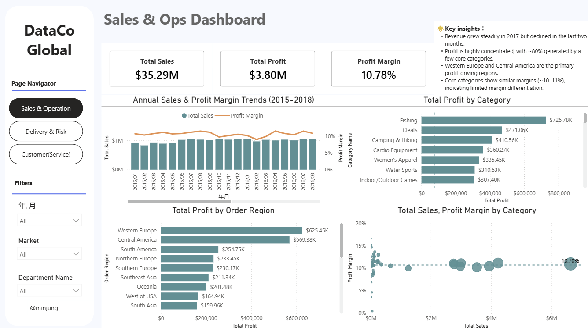
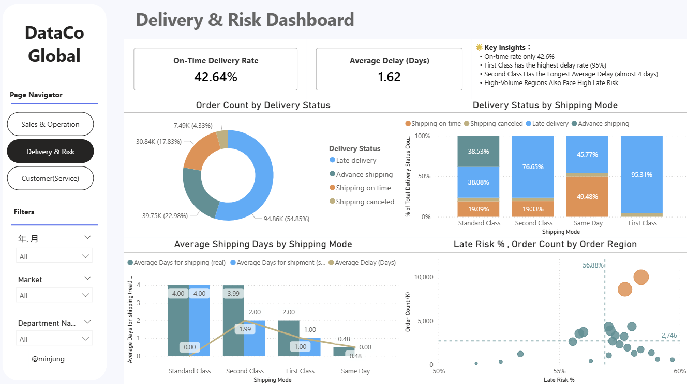
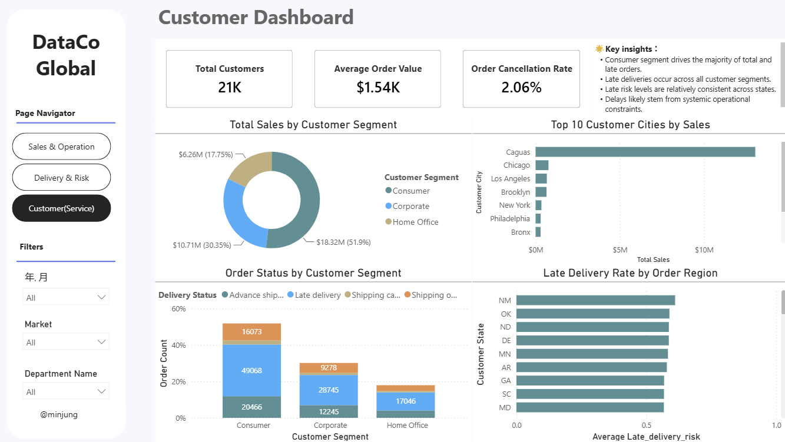

# Operations Performance Dashboard
Analysis based on the DataCo Global Supply Chain Dataset

## 👩‍💻Project Overview

This project presents an interactive **Power BI dashboard** designed to analyze operational performance within a global supply chain dataset.

The dashboard transforms raw operational data into actionable insights to support **business monitoring, operational analysis, and decision-making**.

The analysis focuses on three key perspectives:

- Sales & Operations Performance
- Delivery & Risk
- Customer Segmentation

---

## 📊Dashboard Preview

## 📬Power BI File

Download the Power BI dashboard file:

[Download PBIX](dashboard/datacoglobal.pbix)

---

## 🔍Business Questions

This dashboard was designed to help answer the following operational questions:

- Which product categories generate the most profit?
- Which regions contribute the most to overall business performance?
- How efficient are current delivery operations?
- Which shipping modes have the highest delay risk?
- How do customer segments contribute to total sales?

---

## 💡Key Insights

### Sales & Operations

- Revenue grew steadily during **2017**, but declined slightly in the final months.
- Approximately **80% of total profit comes from a small number of product categories**, indicating profit concentration.
- **Western Europe and Central America** are the primary profit-driving regions.
- Core categories maintain **similar profit margins (~10–11%)**, suggesting limited margin differentiation.

---

### Delivery & Risk Monitoring

- The overall **on-time delivery rate is only 42.6%**, indicating potential logistics inefficiencies.
- **First Class shipping shows the highest delay rate (~95%)**, despite being a premium shipping option.
- **Second Class shipping experiences the longest average delay (~4 days)**.
- High-volume regions also show **higher late delivery risk**, suggesting operational capacity constraints.

---

### Customer Insights

- The **Consumer segment generates the majority of total sales and late orders**.
- Late deliveries occur across **all customer segments**, indicating a systemic operational issue.
- Late delivery risk is relatively consistent across regions.
- Delivery delays likely stem from **structural operational constraints rather than localized issues**.

---

## 📔Tools & Skills Demonstrated

- Power BI
- DAX Measures
- Data Visualization
- Business Analysis

---

## 📁Dataset

This project uses the **DataCo Global Supply Chain Dataset**, which contains transactional data related to global supply chain operations including orders, products, shipping methods, and customer information.

🧷Dataset Source:  
https://www.kaggle.com/datasets/shashwatwork/dataco-smart-supply-chain-for-big-data-analysis/data?select=DataCoSupplyChainDataset.csv
